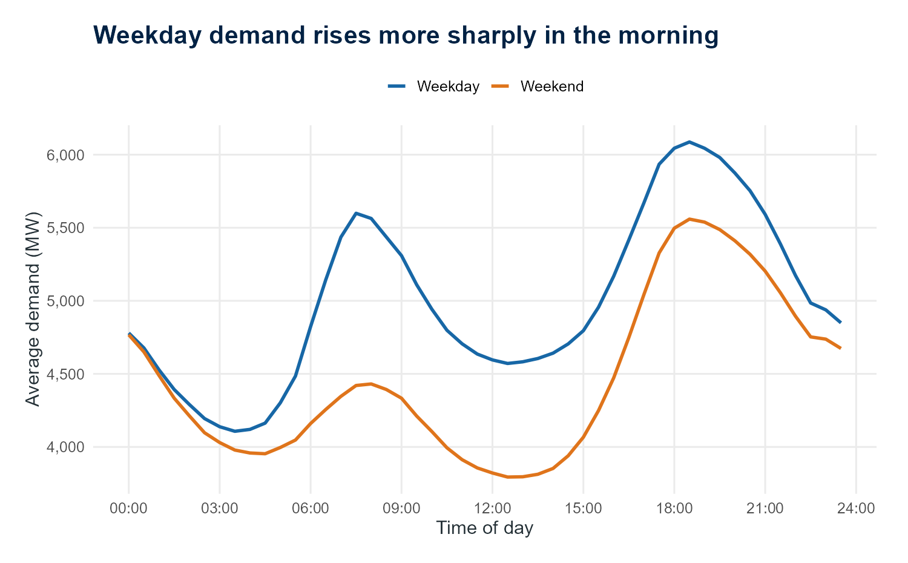
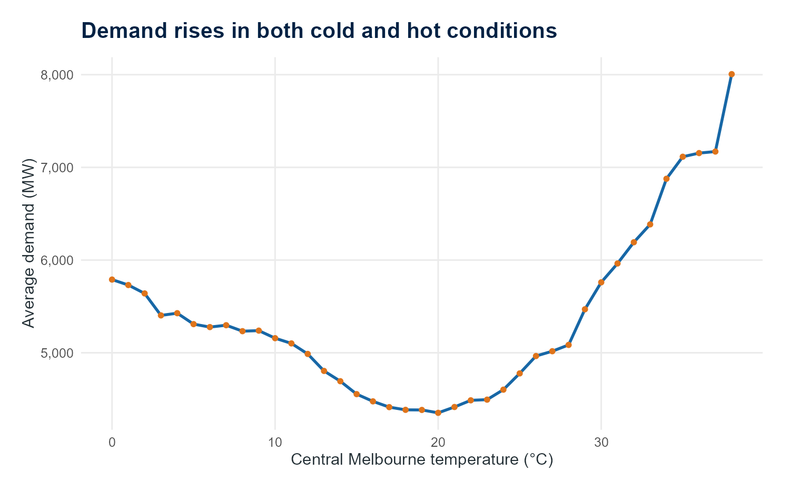
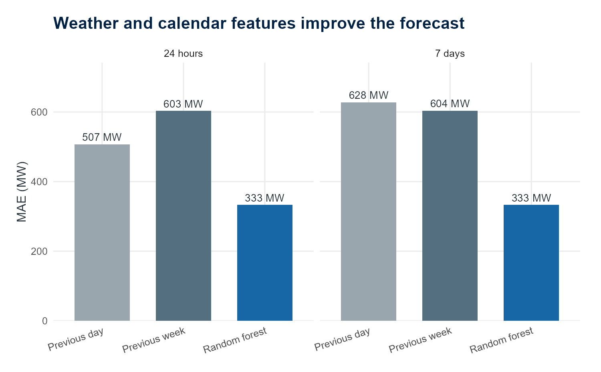

::: project-hero
::: project-hero-inner
::: project-hero-copy
<p class="project-kicker">ENERGY · DATA ANALYSIS · FORECASTING</p>

# What drives Victoria's electricity demand?

<p class="project-deck">What seven years of half-hourly data reveal about daily routines, weather, public holidays and forecasting demand.</p>

<p class="project-date">Published 12 August 2026</p>
:::
::: project-hero-motif
```{=html}
<svg viewBox="0 0 420 220" role="img" aria-label="A stylised daily electricity-demand curve">
  <line x1="0" y1="180" x2="420" y2="180" class="motif-axis" />
  <line x1="0" y1="120" x2="420" y2="120" class="motif-grid" />
  <line x1="0" y1="60" x2="420" y2="60" class="motif-grid" />
  <polyline points="0,122 35,156 70,168 105,142 140,70 175,94 210,132 245,142 280,126 315,54 350,34 385,72 420,116" class="motif-line" />
  <circle cx="350" cy="34" r="6" class="motif-peak" />
  <text x="0" y="207">00:00</text>
  <text x="185" y="207">12:00</text>
  <text x="370" y="207">24:00</text>
</svg>
```
<p>A typical Victorian demand day</p>
:::
:::
:::

::: project-article

Electricity demand follows a rhythm, but it is not a simple one. The time of day matters. So do the season, the weather, working patterns and public holidays. Extreme conditions can push demand well beyond its usual range, which makes forecasting especially important when the system is under pressure.

I built this project to investigate half-hourly scheduled electricity demand in Victoria from 2019 to 2025. The analysis combines Australian Energy Market Operator demand data with central Melbourne weather, Victorian public holidays, calendar information and daylight-saving periods.

<div class="project-stats">
  <div><strong>122,736</strong><span>half-hour observations</span></div>
  <div><strong>7 years</strong><span>from 2019 to 2025</span></div>
  <div><strong>2 horizons</strong><span>24 hours and 7 days</span></div>
</div>

## What I wanted to understand

The project began with a set of practical questions:

- How does demand change through the day and across the seasons?
- How strongly is demand related to temperature?
- What changes on weekends, public holidays and during daylight saving?
- Can a weather- and calendar-aware model outperform simple forecasts based on yesterday or last week?
- When does the model make its largest errors?

## A clear daily and seasonal rhythm

Victorian demand has a strong daily cycle. Weekdays rise more sharply in the morning than weekends, while winter evenings and summer afternoons stand out across the year. Average demand was highest on Thursday and lowest on Saturday.

These patterns are consistent with several forces acting at once. Work and school schedules help explain the weekday profile, while heating and cooling needs are consistent with higher demand during cold periods and hot afternoons.

{.project-chart}

::: project-finding
<span>Finding 1</span>

**Demand does not have one typical daily profile. The shape changes with the day of the week and the season.**
:::

## Temperature matters at both extremes

The relationship between demand and temperature is U-shaped. Average demand was lowest at around **20–21°C**, then increased in both colder and hotter conditions. This is consistent with electricity being used for heating during cold periods and cooling during hot periods.

The relationship is descriptive rather than automatically causal. Temperature overlaps with season, daylight hours and other changes in behaviour. Even so, it is one of the clearest patterns in the data.

{.project-chart}

::: project-finding
<span>Finding 2</span>

**Comfortable conditions coincide with lower demand; very cold and very hot conditions place more pressure on the system.**
:::

## The calendar changes the normal profile

Public-holiday demand averaged **16.2% below normal weekdays**. The result fits the different schedule of offices, shops, schools and industry on those days.

Demand profiles also differed between standard time and daylight-saving periods. That comparison needs care: the clock change happens alongside changes in season and temperature, so it should not be read as a causal estimate of daylight saving by itself.

## Forecasting: simple baselines first

Before using machine learning, I established two transparent benchmarks:

- **Previous day:** use demand from the same half-hour yesterday.
- **Previous week:** use demand from the same half-hour one week earlier.

The forecasts were evaluated chronologically on unseen periods in 2025. This preserves the order of the time series and avoids training a model with information from its future.

I then compared those baselines with a random forest using time, weather, calendar and seasonal features. In this evaluation, the random forest produced the lowest average half-hour error: a mean absolute error of **333 MW** for both the 24-hour and seven-day horizons. It improved on the strongest baseline by **34.4% at 24 hours** and **44.9% at seven days**.

<div class="project-stats project-stats-forecast">
  <div><strong>333 MW</strong><span>24-hour MAE</span></div>
  <div><strong>333 MW</strong><span>seven-day MAE</span></div>
  <div><strong>44.9%</strong><span>seven-day improvement</span></div>
</div>

{.project-chart}

The random forest therefore performed best for typical half-hour accuracy in this comparison, but it did not win every measure. The previous-week baseline retained a lower seven-day peak-demand error. That distinction matters: improving average accuracy is not the same as forecasting the week's highest demand accurately, and the result should not be interpreted as proof that one model will always perform best.

## What I took from the project

I shaped the project scope, research questions, data choices, modelling comparisons and report design, and reviewed and refined the analysis throughout. Working with half-hourly Victorian demand data strengthened my understanding of checking timestamp continuity, aligning demand with hourly weather and calendar information, and evaluating forecasts chronologically against previous-day and previous-week baselines. AI-assisted tools supported parts of the coding, debugging and documentation.

The most important modelling lesson was the value of starting with simple baselines. A machine-learning model is only useful if it performs better than a clear and credible alternative. The project also showed why forecast performance should be assessed against the decision being made: a model that is better on average may still need improvement before it is relied on for extreme peaks.

## Limits and next steps

This is an analytical project rather than a production forecasting system. The target is scheduled demand derived from AEMO dispatch data, which is not identical to AEMO operational demand. Central Melbourne weather is only a proxy for conditions across Victoria, and the model uses observed reanalysis weather rather than the weather forecasts that would have been available in real time.

Useful next steps would include archived weather forecasts, more Victorian weather locations, prediction intervals and a model trained specifically to handle peak demand.

::: project-cta
## Explore the full interactive report

The complete report includes interactive charts, the data-quality audit, forecasting comparisons, error analysis and methodology.

[Open the Victoria Electricity Demand report](https://ads0094.github.io/VIC-Electricity-Demand-Forecasting/){.project-button target="_blank"}
:::

:::
