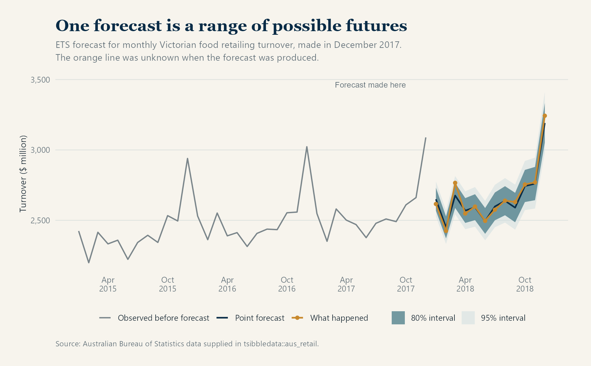
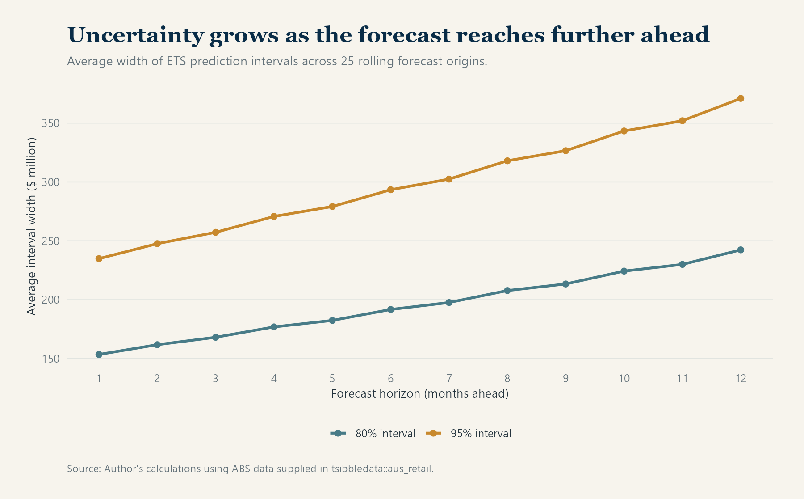
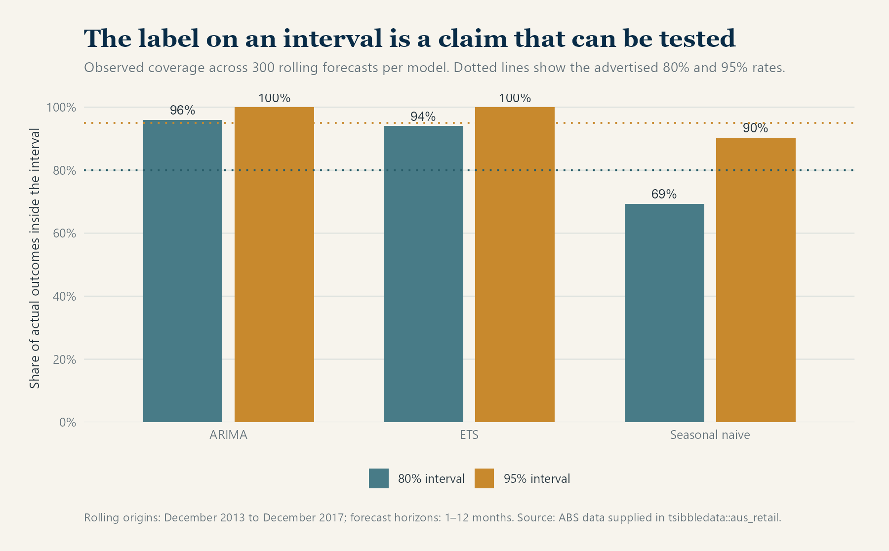
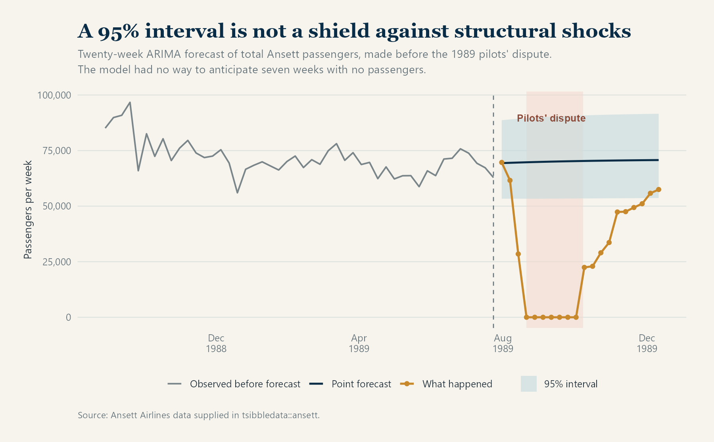

::: hero
<h1>Why Every Forecast Should Show Uncertainty</h1>

<em>A point forecast gives one answer. A prediction interval shows how uncertain that answer really is.</em>

Statistics · Forecasting · Uncertainty

:::

:::: section-grey
::: content

Published:
August 14, 2026

A forecast expressed as a single number can feel more certain than it deserves.

Suppose a model predicts that Victorian food retailing turnover next month will be $2.7 billion. That number may be the model's best central estimate, but it says nothing about whether $2.69 billion and $2.71 billion are the only credible outcomes, or whether anything from $2.5 billion to $2.9 billion would be unsurprising.

This is the limitation of a **point forecast**. It compresses a range of possible futures into one value. Depending on the method and the decision being made, that value might be a mean, a median or another central summary. It is useful, but incomplete.

A **prediction interval** adds the missing context. Instead of reporting only $2.7 billion, we might report an 80% interval from $2.55 billion to $2.85 billion and a 95% interval from $2.45 billion to $2.95 billion. The wider interval represents a higher level of coverage, not a second competing forecast.

> The interval does not weaken the forecast. It makes the forecast's uncertainty visible.

## What does an 80% prediction interval mean?

The percentage requires careful interpretation. If a forecasting method is properly calibrated, then across many comparable forecasts, approximately 80% of observed outcomes should fall inside its 80% prediction intervals. Likewise, a well-calibrated 95% method should capture approximately 95% of outcomes.

It does **not** mean that every set of ten 80% intervals must contain exactly eight observations. Nor does a result outside a 95% interval prove that the model is useless. Outcomes outside the interval should occur occasionally. The question is whether they occur about as often as the method claims.

This repeated-forecast interpretation is central to the discussion of forecast distributions and prediction intervals in Hyndman and Athanasopoulos' [*Forecasting: Principles and Practice*](https://otexts.com/fpp3/prediction-intervals.html).

The chart below uses monthly Victorian food retailing turnover from the `aus_retail` dataset supplied with the `fpp3` ecosystem. The model was fitted using information available through December 2017. The orange line shows what happened during 2018, which was unknown at the forecast date.

{.article-chart fig-alt="Monthly Victorian food retailing turnover before and after December 2017. The forecast is shown as a central line surrounded by a dark 80 per cent band and a wider light 95 per cent band. Actual 2018 turnover follows the expected seasonal pattern and remains within the bands."}

The dark band is the 80% interval and the lighter outer band is the 95% interval. Both widen over the year. The point forecast remains a line, but the range of plausible outcomes grows as the model looks further ahead.

## Why uncertainty usually grows with the horizon

A one-month-ahead forecast can use almost all the recent information available. A twelve-month-ahead forecast must pass through eleven intervening months that have not yet occurred. Each unknown step creates another opportunity for the future to depart from the model's central path.

That does not mean every interval must widen smoothly under every possible model. Seasonal information, known future events and changing predictor uncertainty can produce more complicated shapes. But increasing uncertainty with the forecast horizon is a common and sensible pattern.

In the rolling ETS forecasts used here, the average 80% interval grew from about **$153 million** at one month ahead to **$242 million** at twelve months ahead. The corresponding 95% interval expanded from approximately **$235 million** to **$371 million**.

{.article-chart fig-alt="Two upward-sloping lines show average interval width increasing from one to twelve months ahead. The 95 per cent interval is consistently wider than the 80 per cent interval."}

The widening bands communicate something the point forecast cannot: even if the expected seasonal pattern remains stable, confidence in the exact value declines with distance from the last observation.

## The percentage on the label can be tested

An interval marked “95%” is making an empirical claim. We can check that claim by recreating forecasts at historical dates and comparing them with outcomes that were genuinely still in the future at each date.

For this article, I used 441 monthly observations of Victorian food retailing turnover from April 1982 to December 2018. The series contained no missing months or missing turnover values. Starting in December 2013, I moved the forecast origin forward by two months at a time until December 2017. At each of 25 origins, three models produced forecasts for the next twelve months:

- a seasonal naïve model, which repeats the value from the same month one year earlier;
- an exponential smoothing model, or ETS; and
- a seasonal ARIMA model.

This produced 300 forecast–outcome comparisons for each model. The exercise is a rolling historical backtest: no observation was used before it would have become available.

{.article-chart fig-alt="Grouped bars compare actual coverage with dotted target lines. ARIMA covers 96 and 100 per cent, ETS covers 94 and 100 per cent, and seasonal naive covers 69 and 90 per cent for nominal 80 and 95 per cent intervals respectively."}

The results show why interval labels should not simply be accepted.

The seasonal naïve model captured only **69.3%** of outcomes inside its nominal 80% intervals and **90.3%** inside its nominal 95% intervals. Its intervals were too confident for this exercise.

ETS and ARIMA went in the opposite direction. Their nominal 80% intervals captured **94%** and **96%** of outcomes respectively, while their 95% intervals captured every outcome in the test. Relative to the advertised rates, those intervals were conservative over this sample.

Higher coverage is not automatically better. An infinitely wide interval would capture everything and tell us almost nothing. Good interval forecasts balance two properties:

- **coverage:** outcomes fall inside at approximately the stated rate; and
- **sharpness:** intervals remain as narrow as possible while maintaining reliable coverage.

Formal interval scores, such as the Winkler score discussed in [FPP3's section on distributional forecast accuracy](https://otexts.com/fpp3/distaccuracy.html), combine these concerns by penalising unnecessary width and observations that fall outside the interval.

The percentages here are diagnostic rather than universal model rankings. They come from one retail series and overlapping forecast horizons, so the forecast errors are not independent. A model that appears conservative here may behave differently for another industry, period or type of shock.

## What prediction intervals can still miss

Prediction intervals are conditional on a model and its assumptions. They reflect the forms of uncertainty the model has been designed to represent. They do not automatically anticipate strikes, pandemics, sudden regulatory changes, natural disasters or a permanent break in the behaviour of the series.

The `ansett` dataset makes this limitation unusually visible. It contains weekly passenger numbers for Ansett Airlines and includes the major Australian pilots' dispute of 1989. I aggregated passenger counts across the available routes and ticket classes, fitted a model using data available through week 30 of 1989, and forecast the following twenty weeks.

{.article-chart fig-alt="Weekly Ansett passenger numbers fall from roughly 60 to 70 thousand to zero during seven highlighted weeks of the 1989 pilots' dispute, well below a 95 per cent forecast interval centred near 70 thousand."}

The point forecast expected passenger numbers to remain near their previous range. The 95% interval allowed for ordinary variation around that expectation. It did not allow for seven consecutive weeks with no passengers. All seven zero-passenger weeks fell outside the interval.

That is not evidence that prediction intervals are pointless. It is evidence that they have boundaries. A model trained on ordinary airline variation had no mechanism for assigning substantial probability to an industry-wide dispute.

The same issue appears when forecasts depend on future predictors. An electricity-demand model may use tomorrow's temperature, but tomorrow's temperature is itself forecast rather than known. As [FPP3 notes for regression forecasts](https://otexts.com/fpp3/forecasting-regression.html), an interval based on assumed predictor values may omit uncertainty about those future inputs and therefore be too narrow.

## Prediction interval or confidence interval?

The two are often confused.

A **confidence interval** usually describes uncertainty about an estimated quantity, such as a population mean or regression coefficient. A **prediction interval** describes uncertainty about a future observation. The future observation varies around the estimated relationship, so its prediction interval is usually wider than a confidence interval for the corresponding mean.

If the practical question is “what value might we actually observe next month?”, a confidence interval around an average is not a substitute for a prediction interval.

## Questions to ask when someone presents a forecast

Before relying on a forecast, it is worth asking:

1. Is this only a point forecast, or is uncertainty shown?
2. What coverage level does the interval claim?
3. Was that coverage checked using genuinely unseen outcomes?
4. Does the interval widen appropriately over the forecast horizon?
5. Does it account for uncertainty in future inputs?
6. What types of structural change sit outside the model?
7. Is the interval narrow enough to support the decision being made?

No interval can remove uncertainty. Its job is to represent uncertainty honestly enough that a decision-maker can see the range of outcomes being accepted.

## The takeaway

A point forecast answers a convenient question: **what is the central estimate?**

A prediction interval answers the harder and often more useful question: **how far from that estimate could the outcome reasonably move, given the model and what it knows?**

The interval still needs to be tested. It may be too narrow, unnecessarily wide or blind to a structural shock. But without it, the reader cannot even begin to distinguish a dependable central estimate from false precision.

## Data and method notes

The retail analysis uses Victorian “Food retailing” turnover from [`tsibbledata::aus_retail`](https://tsibbledata.tidyverts.org/reference/aus_retail.html), originally sourced from the Australian Bureau of Statistics. The Ansett example uses [`tsibbledata::ansett`](https://tsibbledata.tidyverts.org/reference/ansett.html). Both datasets are made available through the tidyverts packages loaded by `fpp3`.

The retail backtest used every second monthly origin from December 2013 through December 2017 and evaluated horizons from one to twelve months. ETS and seasonal ARIMA were fitted to log turnover; the ARIMA specification was held fixed across forecast origins. The Ansett chart uses an ARIMA model fitted to log-transformed total passenger counts. The complete calculations and chart generation are recorded in `scripts/create_forecast_uncertainty_analysis.R` within the site project.

The conceptual explanation follows Rob J Hyndman and George Athanasopoulos, [*Forecasting: Principles and Practice*, third edition](https://otexts.com/fpp3/), particularly its sections on the statistical forecasting perspective, prediction intervals and distributional forecast evaluation.

<footer class="site-footer">© 2026 A Thinking Nerd | All thoughts my own.</footer>
:::
::::
