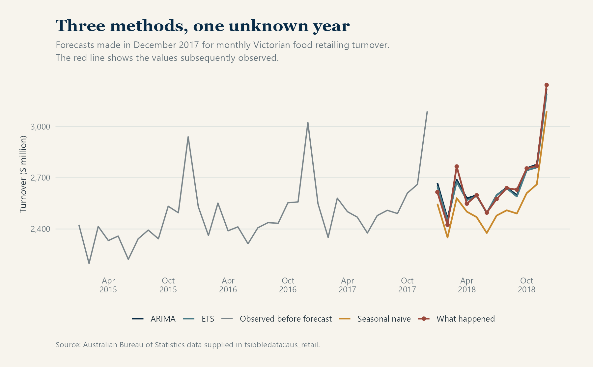
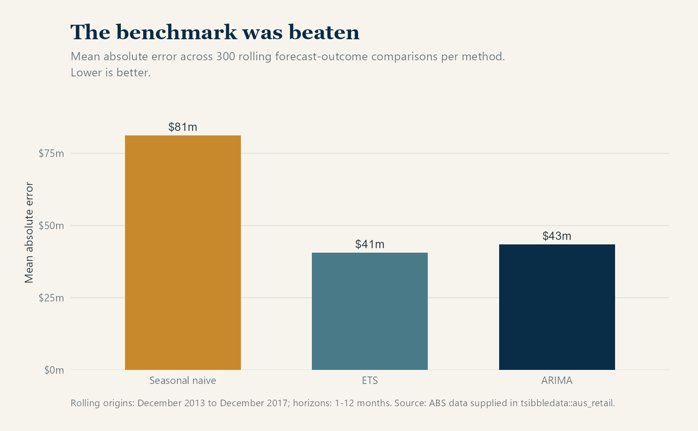
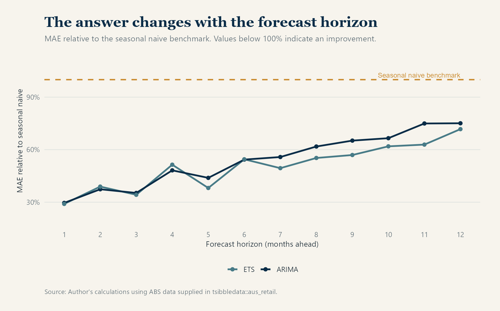

::: hero
<h1>Why Simple Forecasting Models Are Difficult to Beat</h1>

<em>A complicated model may fit the past well. It still has to forecast the future better than a sensible rule.</em>

Statistics · Forecasting · Model evaluation

:::

:::: section-grey
::: content

Published:
August 25, 2026

When a forecasting project begins, most of the attention usually goes to the model: which method to use, which variables to include and how far its parameters should be tuned. That is understandable, but it can put the process in the wrong order. Before deciding whether a model is good, we need to know what it improves upon.

Consider an average forecast error of $40 million. The figure looks precise, yet on its own it tells us very little. If a simple seasonal rule produces roughly the same error, the additional model may not be worth maintaining. If that rule produces an error of $80 million, the more formal model has clearly added something useful.

For that reason, a credible benchmark should be established early in a forecasting exercise. This is standard forecasting practice: its purpose is not simply to make the analysis look complete, but to give the final accuracy result something meaningful to beat.

## Start with something sensible

The choice of benchmark should reflect the way the series behaves. For short term electricity demand, yesterday or the same day last week may offer a reasonable starting point. Monthly retail turnover follows a strong annual pattern, which makes a seasonal naïve forecast more suitable. It simply uses the value observed in the same month of the previous year.

At first glance, that rule can seem too crude to be useful. It nevertheless preserves the main seasonal structure without estimating a large number of relationships, and it leaves little room for the model to mistake temporary noise for a persistent pattern.

Other familiar benchmarks include the historical mean, the latest observation and a drift forecast based on the average change over time. [*Forecasting: Principles and Practice*](https://otexts.com/fpp3/simple-methods.html) recommends these methods because they are often surprisingly competitive. Even when a more formal model wins, the benchmark tells us how much has actually been gained.

## What I compared

For the comparison, I returned to the monthly Victorian food retailing series used in my article on forecast uncertainty. The data, measured in millions of Australian dollars, come from the Australian Bureau of Statistics and are supplied through [`tsibbledata::aus_retail`](https://tsibbledata.tidyverts.org/reference/aus_retail.html).

Rather than fitting the models once and judging them on the same observations, I followed the rolling forecast origin approach described in FPP3. I repeated the exercise at 25 historical cutoff dates between December 2013 and December 2017. At each date, the models used only the information available at that time and forecast the following twelve months. As the cutoff moved forward, the models were estimated again with the newly available history.

I compared three procedures:

1. a seasonal naïve forecast;
2. an ETS model fitted to log turnover; and
3. a seasonal ARIMA model fitted to log turnover.

The ETS description deserves some precision. At every origin, `ETS(log(Turnover))` compared the eligible ETS structures using AICc and selected `ETS(A,A,A)`. The letters refer, in order, to the error, trend and seasonal components, all of which were additive on the log scale. Although the structure remained the same, the smoothing parameters were estimated again at each origin. This is the automatic selection procedure described in the [fable documentation](https://fable.tidyverts.org/reference/ETS.html) and the [ETS model selection chapter of FPP3](https://otexts.com/fpp3/ets-estimation.html).

For ARIMA, I held the specification fixed at `ARIMA(0,1,1)(0,1,1)[12]`. The exercise was therefore a comparison of three defined forecasting procedures rather than a search across every possible ETS and ARIMA variation.

The cutoff moved forward by two months at a time, and each date produced forecasts for the following twelve months. This resulted in 25 forecast origins and 300 forecast comparisons for each method. The chart below shows the final set of forecasts, made in December 2017, alongside the turnover values that were later observed during 2018.

{.article-chart fig-alt="Monthly Victorian food retailing turnover from 2015 to 2018. Three forecast lines begin after December 2017 and are compared with the values observed during 2018."}

All three methods capture the broad seasonal movement, though their predicted levels differ, especially in the seasonal naïve forecast. Looking at a single year is informative, but it is not enough to decide which method performed best; that judgement needs the full set of historical forecasts.

## In this case, ETS won clearly

Across the 300 comparisons, ETS produced a mean absolute error of **$40.6 million**, followed by ARIMA at **$43.5 million**. The seasonal naïve benchmark was much less accurate, with an error of **$81.2 million**.

{.article-chart fig-alt="Three bars compare mean absolute error. ETS has the lowest error at about 41 million dollars, ARIMA is close at about 44 million, and seasonal naive is highest at about 81 million."}

For this series and evaluation period, ETS reduced the average absolute error by about 50 per cent relative to the benchmark, while ARIMA reduced it by roughly 46 per cent. The additional modelling was justified, at least according to this measure.

What makes that conclusion useful is the comparison itself. An ETS error of $40.6 million does not carry an obvious meaning in isolation. Once it is placed beside the $81.2 million seasonal benchmark, the scale of the improvement becomes clear.

## The advantage changed with the forecast horizon

The size of the advantage also changed with the forecast horizon. At one month ahead, the ETS error was only 29 per cent of the seasonal naïve error. By twelve months ahead, it had risen to 72 per cent. ETS remained more accurate throughout the exercise, although its lead narrowed as the forecasts extended further into the future.

{.article-chart fig-alt="Two lines show ETS and ARIMA error relative to a seasonal naive benchmark of 100 per cent. Both methods remain below the benchmark from one to twelve months ahead, but their relative error increases at longer horizons."}

## Why complexity can still disappoint

More flexible models have a greater chance of capturing useful patterns, provided those patterns are stable. The difficulty is that flexibility also makes it easier to fit relationships that belong only to the training period, particularly when the available series is short.

Forecasting relationships may weaken after a policy change, a pandemic or a shift in consumer behaviour. Predictors bring their own complications as well. When a demand forecast uses tomorrow's temperature, for example, part of its performance depends on a weather forecast that is itself uncertain.

Model selection can introduce a subtler problem. If many alternatives are repeatedly judged against the same test period, that period begins to influence the choice even though its observations never appear directly in model estimation. What was intended to be an independent test can gradually become part of the tuning process.

Because simple methods estimate very little, they are less exposed to some of these problems. This does not make them automatically superior; it explains why a more complicated method should be required to demonstrate its advantage.

## What the broader evidence shows

The history of forecasting competitions offers a broader version of the same lesson. In the [M4 competition](https://doi.org/10.1016/j.ijforecast.2018.06.001), 61 methods were evaluated across 100,000 time series. Twelve of the 17 most accurate methods were combinations built mainly from statistical approaches. A hybrid method won the competition, while the pure machine learning entries did not beat its main combination benchmark.

By the time of the [M5 accuracy competition](https://doi.org/10.1016/j.ijforecast.2021.11.013), the setting was different. The competition used 42,840 related Walmart sales series together with information such as prices and calendar events. Global machine learning methods performed strongly because they could learn across many connected series and draw on information unavailable to a basic time series model.

These results do not establish that one family of methods is generally better than another. Rather, they show why the usefulness of complexity depends on the structure of the data, the forecast horizon and the information available when the forecast is made.

## What I take from the comparison

In this particular test, the seasonal naïve model lost by a wide margin. That is not a failure of benchmarking, since a benchmark is not there to protect a simple method from losing. Its role is to make any improvement visible and measurable.

Had ETS matched the seasonal naïve result, there would have been little reason to prefer it. Instead, it roughly halved the average error across periods that were genuinely still in the future, which provides a clear case for the added modelling.

The practical lesson is to begin with a credible simple forecast, reproduce the conditions in which the model will actually be used and then compare the alternatives on unseen periods. Complexity is worthwhile when that evidence supports it.

## Data and method notes

The analysis uses monthly Victorian “Food retailing” turnover from [`tsibbledata::aus_retail`](https://tsibbledata.tidyverts.org/reference/aus_retail.html). The dataset identifies the Australian Bureau of Statistics, catalogue 8501.0, table 11, as its original source. The selected series contains 441 observations from April 1982 to December 2018, with no missing months or missing turnover values.

The backtest moved forward by two months at a time from December 2013 to December 2017. Each of the 25 origins produced forecasts for horizons from one to twelve months. Mean absolute error was calculated from the same 300 future observations for each method. I also recalculated the figures with `fabletools::accuracy()`, which returned the same MAE and RMSE results as the direct error calculations.

The evaluation design follows the principles described in FPP3's sections on [point forecast accuracy](https://otexts.com/fpp3/accuracy.html) and [time series cross validation](https://otexts.com/fpp3/tscv.html).

<footer class="site-footer">© 2026 A Thinking Nerd | All thoughts my own.</footer>
:::
::::
